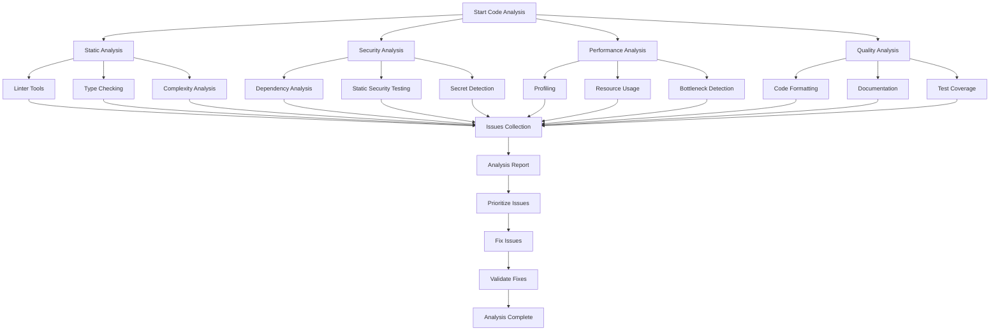
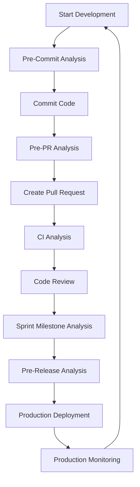

# AI News Kubernetes Project - Code Analysis Template

This document outlines the standardized approach for analyzing code within the AI News Kubernetes project. Code analysis is a critical practice that helps maintain code quality, optimize performance, identify security vulnerabilities, and ensure adherence to best practices.

## Code Analysis Approach



## Static Code Analysis

### Linting

Use Python linting tools to identify code quality issues:

```bash
# Run flake8 linter
flake8 src/ --count --select=E9,F63,F7,F82 --show-source --statistics

# Run pylint
pylint src/

# Run black in check mode
black --check src/
```

Common issues to check for:
- Unused imports and variables
- Undefined variables
- Syntax errors
- Style guide violations
- Import ordering

### Type Checking

Use mypy for static type checking:

```bash
mypy src/
```

Focus on:
- Missing type annotations
- Type mismatches
- Optional/None handling issues

### Complexity Analysis

Analyze code complexity to identify areas for refactoring:

```bash
# Install and run radon
pip install radon
radon cc src/ -a -s

# Install and run xenon for enforcing complexity thresholds
pip install xenon
xenon --max-absolute B --max-modules A --max-average A src/
```

Targets:
- Cyclomatic complexity < 10 per function
- Maintainability index > 65
- Too many nested blocks (max depth of 4)

## Security Analysis

### Dependency Scanning

Check for vulnerable dependencies:

```bash
# Using safety
pip install safety
safety check -r requirements.txt

# Using pip-audit
pip-audit
```

Review:
- Known vulnerabilities in dependencies
- Outdated packages
- License compliance

### Static Application Security Testing (SAST)

Scan for security vulnerabilities:

```bash
# Using bandit
bandit -r src/
```

Focus on:
- Input validation issues
- Path traversal vulnerabilities
- Injection vulnerabilities
- Insecure defaults

### Secret Detection

Scan for hardcoded secrets:

```bash
# Using trufflehog
trufflehog filesystem --directory=./src
```

Check for:
- API keys
- Passwords
- Private keys
- Access tokens

## Performance Analysis

### Code Profiling

Profile code execution to identify bottlenecks:

```python
# Basic profiling using cProfile
import cProfile
import pstats

def profile_function(func, *args, **kwargs):
    profiler = cProfile.Profile()
    profiler.enable()
    result = func(*args, **kwargs)
    profiler.disable()
    stats = pstats.Stats(profiler).sort_stats('cumulative')
    stats.print_stats(20)
    return result

# Example usage
profile_function(some_function, arg1, arg2)
```

Look for:
- Functions with high call counts
- Functions with high cumulative time
- Unexpected performance patterns

### Resource Usage Analysis

Monitor memory and CPU usage:

```python
# Using memory_profiler
from memory_profiler import profile

@profile
def memory_intensive_function():
    # function code
    pass
```

For Kubernetes deployments:
```bash
# Check pod resource usage
kubectl top pod -n ai-news

# Analyze resource requests vs usage
kubectl describe pod -n ai-news
```

### Bottleneck Detection

Identify bottlenecks in the application:

- Network calls (especially external API calls)
- Disk I/O operations
- Database queries
- Inefficient algorithms
- Unnecessary processing

## Code Quality Analysis

### Code Formatting

Ensure consistent code formatting:

```bash
# Format code with black
black src/

# Sort imports with isort
isort src/
```

### Documentation Analysis

Check documentation quality and completeness:

```bash
# Generate documentation coverage report
pip install interrogate
interrogate -v src/
```

Review:
- Function and class docstrings
- Module docstrings
- README and other documentation
- Comments for complex code sections

### Test Coverage Analysis

Analyze test coverage:

```bash
# Generate coverage report
pytest --cov=src tests/
coverage report
coverage html  # For detailed HTML report
```

Targets:
- Overall coverage > 80%
- Critical paths coverage > 90%
- Edge cases tested

## Analysis Report Template

When performing code analysis, document the findings using this template:

### Code Analysis Report

**Date**: [YYYY-MM-DD]  
**Analyzed Components**: [List files/modules analyzed]  
**Analyst**: [Name]  
**Tools Used**: [List tools used]

#### Summary

[Brief overview of analysis findings]

#### Static Analysis Results

| Category | Tool | Issues | Severity |
|----------|------|--------|----------|
| Linting | flake8 | X issues | Low/Medium/High |
| Type Checking | mypy | X issues | Low/Medium/High |
| Complexity | radon | X functions above threshold | Low/Medium/High |

#### Security Analysis Results

| Category | Tool | Issues | Severity |
|----------|------|--------|----------|
| Dependencies | safety | X vulnerable packages | Low/Medium/High |
| SAST | bandit | X security issues | Low/Medium/High |
| Secrets | trufflehog | X secrets found | Low/Medium/High |

#### Performance Analysis Results

| Category | Observations | Severity |
|----------|--------------|----------|
| Profiling | [Key findings] | Low/Medium/High |
| Resource Usage | [Key findings] | Low/Medium/High |
| Bottlenecks | [Key findings] | Low/Medium/High |

#### Code Quality Results

| Category | Tool | Results | Severity |
|----------|------|---------|----------|
| Formatting | black | X files need formatting | Low/Medium/High |
| Documentation | interrogate | X% coverage | Low/Medium/High |
| Test Coverage | pytest-cov | X% coverage | Low/Medium/High |

#### Critical Issues

[List of most critical issues that need immediate attention]

1. [Issue 1] - [Impact] - [Recommendation]
2. [Issue 2] - [Impact] - [Recommendation]
3. [Issue 3] - [Impact] - [Recommendation]

#### Recommendations

[List of recommended actions]

1. [Recommendation 1]
2. [Recommendation 2]
3. [Recommendation 3]

#### Action Plan

| Action | Priority | Assignee | Target Date | Status |
|--------|----------|----------|-------------|--------|
| [Action 1] | High/Medium/Low | [Name] | [Date] | Not Started |
| [Action 2] | High/Medium/Low | [Name] | [Date] | Not Started |
| [Action 3] | High/Medium/Low | [Name] | [Date] | Not Started |

## Code Analysis Workflow

### When to Perform Code Analysis

1. **Pre-commit**: Basic linting and formatting checks
2. **Pre-PR**: Full static analysis and test coverage
3. **Sprint Milestone**: Comprehensive analysis including performance and security
4. **Before Major Releases**: Complete analysis workflow with all tools
5. **On Dependency Updates**: Focus on security analysis

### Code Analysis Integration with Development Workflow



### Makefile Integration

Add the following targets to the project Makefile:

```makefile
.PHONY: analyze
analyze: lint type-check security test-coverage ## Run full code analysis

.PHONY: lint
lint: ## Run linting tools
	@echo "Running flake8..."
	flake8 src/
	@echo "Running pylint..."
	pylint src/
	@echo "Checking formatting with black..."
	black --check src/
	@echo "Checking import order with isort..."
	isort --check-only src/

.PHONY: type-check
type-check: ## Run type checking
	@echo "Running mypy..."
	mypy src/

.PHONY: complexity
complexity: ## Check code complexity
	@echo "Analyzing code complexity..."
	radon cc src/ -a -s
	xenon --max-absolute B --max-modules A --max-average A src/

.PHONY: security
security: ## Run security checks
	@echo "Checking dependencies for security issues..."
	safety check -r requirements.txt
	@echo "Running static security analysis..."
	bandit -r src/

.PHONY: test-coverage
test-coverage: ## Run tests with coverage
	@echo "Running tests with coverage..."
	pytest --cov=src tests/
	coverage report

.PHONY: format
format: ## Format code
	@echo "Formatting code with black..."
	black src/
	@echo "Sorting imports with isort..."
	isort src/

.PHONY: docs-coverage
docs-coverage: ## Check documentation coverage
	@echo "Checking documentation coverage..."
	interrogate -v src/

.PHONY: profile
profile: ## Run profiling tools
	@echo "Running profiling (requires manual setup)..."
	python -m cProfile -o profile_output.prof src/main.py
	python -c "import pstats; p = pstats.Stats('profile_output.prof'); p.sort_stats('cumulative').print_stats(20)"
```

## Tool Installation and Configuration

### Required Tools

```bash
# Install all required tools
pip install flake8 pylint black isort mypy radon xenon safety bandit interrogate pytest pytest-cov coverage memory-profiler
```

### Tool Configuration

#### flake8 (.flake8)
```ini
[flake8]
max-line-length = 88
extend-ignore = E203
exclude = .git,__pycache__,docs,build,dist
```

#### pylint (.pylintrc)
```ini
[MASTER]
disable=
    C0111, # missing docstring
    C0103, # invalid name
    C0330, # bad continuation
    C1801, # len-as-condition
    R0903, # too-few-public-methods
    R0913, # too-many-arguments
    W0621, # redefining name from outer scope

[FORMAT]
max-line-length=88
```

#### mypy (mypy.ini)
```ini
[mypy]
python_version = 3.9
warn_return_any = True
warn_unused_configs = True
disallow_untyped_defs = False
disallow_incomplete_defs = False
```

#### black (pyproject.toml)
```toml
[tool.black]
line-length = 88
target-version = ['py39']
include = '\.pyi?$'
exclude = '''
/(
    \.eggs
  | \.git
  | \.hg
  | \.mypy_cache
  | \.tox
  | \.venv
  | _build
  | buck-out
  | build
  | dist
)/
'''
```

#### isort (pyproject.toml)
```toml
[tool.isort]
profile = "black"
line_length = 88
```

## Conclusion

Following this code analysis template ensures that the project maintains high code quality, security, and performance standards. By integrating these practices into the development workflow, issues can be identified and resolved early, leading to a more maintainable and robust application.

Remember to update the analysis techniques and tools as new best practices emerge or as the project's needs evolve.
