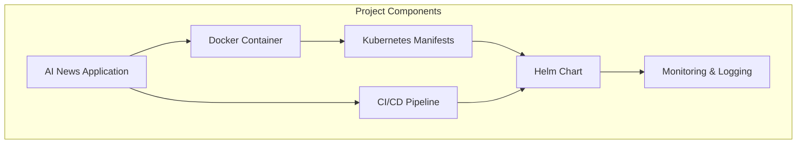
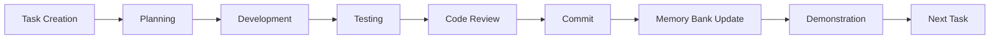
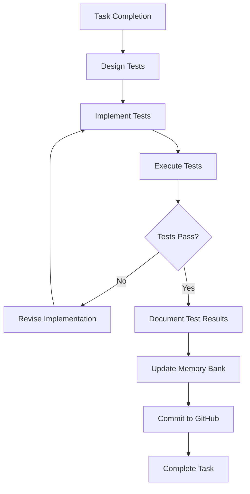
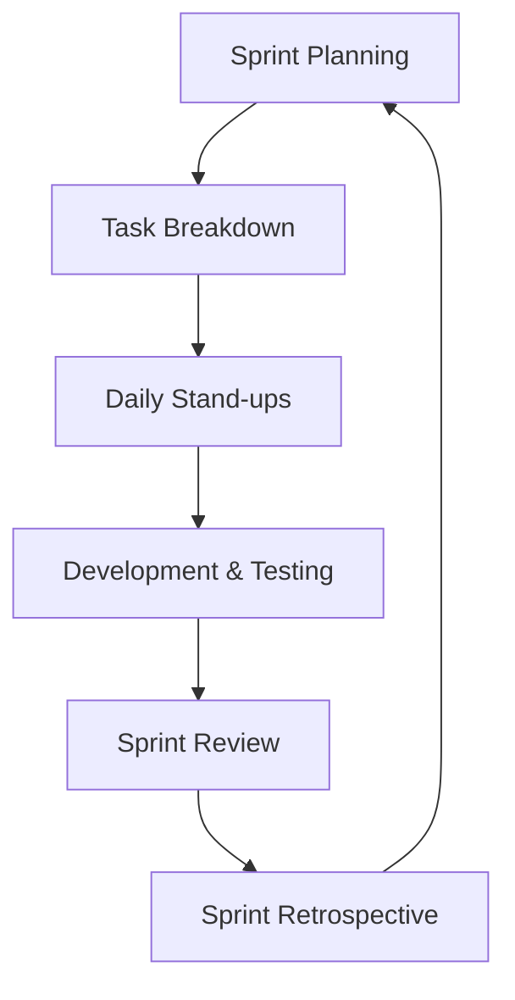

# AI News Kubernetes Project - Organization Guide

This document serves as the main index for the AI News Kubernetes project organization, providing links to all templates and guidelines that define our workflow, processes, and standards.

## Project Overview

The AI News application is a Kubernetes-deployed service that aggregates news from various AI-focused sources and presents them in a modern, card-based interface. The application has been successfully containerized and deployed to a Kubernetes cluster using Helm, with comprehensive monitoring, logging, and testing capabilities.



## Memory Bank System

The Memory Bank is our central knowledge repository, which captures all project information, decisions, and progress. It's critical for maintaining continuity and knowledge transfer.

| File | Purpose | Update Frequency |
|------|---------|------------------|
| [projectbrief.md](projectbrief.md) | Foundation document defining core requirements | Rarely (major scope changes) |
| [productContext.md](productContext.md) | Why the project exists, problems it solves | Occasionally (feature changes) |
| [systemPatterns.md](systemPatterns.md) | System architecture and design decisions | When architecture evolves |
| [techContext.md](techContext.md) | Technologies, development setup, constraints | When tech stack changes |
| [activeContext.md](activeContext.md) | Current focus, recent changes, next steps | Frequently (task completion) |
| [progress.md](progress.md) | Task tracking, status, and known issues | With each task completion |

## Project Organization Templates

These templates define our standardized approach to various aspects of the project:

### Process Templates

| Template | Purpose |
|----------|---------|
| [cline-custom-instructions.md](cline-custom-instructions.md) | Comprehensive guide to project organization and workflow |
| [prompt-template.md](prompt-template.md) | Standardized format for task requests |
| [retrospective-template.md](retrospective-template.md) | Guide for conducting sprint retrospectives |

### Development Templates

| Template | Purpose |
|----------|---------|
| [makefile-template.md](makefile-template.md) | Central interface for all project operations |
| [testing-strategy-template.md](testing-strategy-template.md) | Comprehensive approach to testing all components |
| [code-analysis-template.md](code-analysis-template.md) | Standardized approach to code quality and analysis |

## Core Workflows

Our project follows standardized workflows that ensure consistency, quality, and efficiency.

### Development Workflow



### Testing Workflow



### Sprint Cycle



## Task Tracking Statuses

Tasks progress through the following statuses:

1. **Not Started**: Task defined in backlog
2. **Started**: Development initiated
3. **Created Testcases**: Test scenarios defined
4. **Finish Development**: Core implementation completed
5. **Tested**: All tests passed
6. **Committed**: Changes committed to GitHub repository
7. **Completed**: Demonstrated to stakeholders

## Deployment Strategy

Our standard deployment workflow:

```bash
# Uninstall previous version
helm uninstall ai-news

# Install new version
helm install ai-news ./charts/ai-news

# Validate deployment
kubectl get pods -n ai-news

# Run tests
helm test ai-news -n ai-news
```

## Important Project Commands

The most commonly used commands in this project:

### Development

```bash
# Set up development environment
make setup

# Run application locally
make run-local

# Format code
make format

# Run linters
make lint
```

### Build and Deploy

```bash
# Build Docker image
make build

# Deploy to Kubernetes
make deploy

# Undeploy from Kubernetes
make undeploy

# View application logs
make logs
```

### Testing

```bash
# Run all tests
make test-all

# Run unit tests
make test-unit

# Run Helm tests
make test-helm

# Test health check endpoints
make test-health-checks
```

### Monitoring and Demo

```bash
# Set up monitoring
make setup-monitoring

# Run demonstration script
make demo-script

# Run monitoring and logging demonstration
make demo-monitoring-logging
```

### Documentation

```bash
# Update Memory Bank files
make update-memory-bank
```

## Getting Started for New Team Members

If you're new to the project, follow these steps:

1. Read the [Memory Bank](./), starting with [projectbrief.md](projectbrief.md)
2. Set up your local environment with `make setup`
3. Familiarize yourself with the [Makefile](../Makefile) and available commands
4. Review the [testing strategy](testing-strategy-template.md)
5. Understand the [code analysis approach](code-analysis-template.md)
6. Follow the [task request template](prompt-template.md) when creating new tasks

## Project Standards

### Code Quality Standards

- Python code follows PEP 8 with Black formatting (88 character line limit)
- All functions have docstrings and type hints
- Test coverage minimum: 80%
- Cyclomatic complexity maximum: 10 per function

### Documentation Standards

- All code changes require corresponding Memory Bank updates
- Diagram standards: Use Mermaid for all diagrams
- Task updates should follow the standard format in progress.md
- Always document test results and key decisions

### Git Practices

- Commit messages follow the format: `[Task ID] Brief description`
- Include detailed bullet points for significant changes
- Never commit code that doesn't pass tests
- Update Memory Bank files in the same commit as code changes

## Conclusion

This organizational system ensures consistent, high-quality development work on the AI News Kubernetes project. By following these templates and guidelines, we maintain a clean, well-documented, and effective development process.

For questions or suggestions about the project organization, please contact the project lead.
