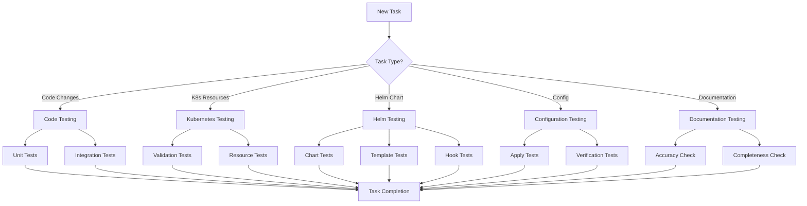
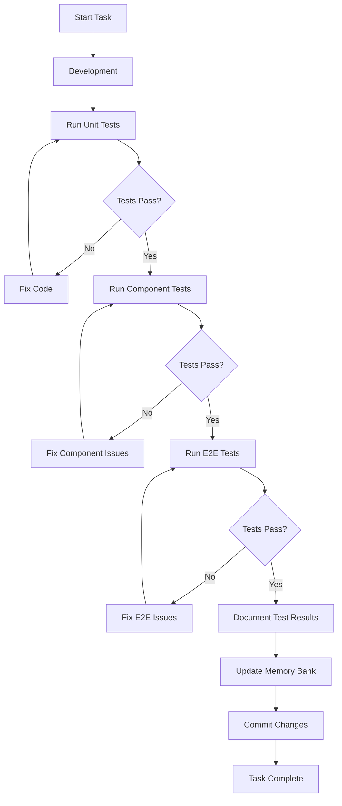

# AI News Kubernetes Project - Testing Strategy

This document outlines the comprehensive testing strategy for the AI News Kubernetes project, ensuring all components are properly tested before being considered complete.

## Testing Philosophy

Our testing approach is built on these core principles:

1. **Test-Driven Development**: Write tests before implementation when possible
2. **Continuous Testing**: Test early, test often, automate everything
3. **Comprehensive Coverage**: Test all levels from unit to end-to-end
4. **Shift Left**: Find issues as early as possible in the development lifecycle
5. **Test for Resilience**: Ensure the system handles failures gracefully
6. **Zero Tolerance**: No task is complete until all tests pass

## Testing Requirements by Task Type



### 1. Code Changes Testing

For any changes to the Python application code:

#### Unit Tests

- Test individual functions, classes, and methods
- Use pytest as the testing framework
- Create test files in `src/tests/` directory following the pattern `test_*.py`
- Target 80%+ code coverage
- Include both positive and negative test cases
- Mock external dependencies (APIs, databases, etc.)

**Example Unit Test**:

```python
# src/tests/test_fetcher.py
import pytest
from unittest.mock import patch
from data.fetcher import RSSFetcher

def test_fetch_news_success():
    # Setup
    test_rss_feed = "http://example.com/rss"
    mock_data = {"title": "Test News", "link": "http://example.com/news"}
    
    # Mock the external RSS feed call
    with patch('data.fetcher.feedparser.parse') as mock_parse:
        mock_parse.return_value = {"entries": [mock_data]}
        
        # Execute
        fetcher = RSSFetcher()
        result = fetcher.fetch_news(test_rss_feed)
        
        # Assert
        assert len(result) == 1
        assert result[0]["title"] == "Test News"

def test_fetch_news_error_handling():
    # Test how the fetcher handles connection errors
    test_rss_feed = "http://example.com/bad-rss"
    
    with patch('data.fetcher.feedparser.parse') as mock_parse:
        mock_parse.side_effect = Exception("Connection error")
        
        fetcher = RSSFetcher()
        result = fetcher.fetch_news(test_rss_feed)
        
        # Should return empty list on error, not crash
        assert result == []
```

#### Integration Tests

- Test interactions between multiple components
- Focus on interfaces and data flow
- Test the full request/response cycle
- Verify correct handling of configuration
- Test caching mechanisms
- Use temporary directories for persistent data

**Example Integration Test**:

```python
# src/tests/test_integration.py
import pytest
import tempfile
import os
from app.ui import create_ui
from data.fetcher import RSSFetcher
from utils.config import Config

@pytest.fixture
def temp_cache_dir():
    with tempfile.TemporaryDirectory() as tmpdirname:
        yield tmpdirname

def test_news_fetching_and_display(temp_cache_dir):
    # Setup
    os.environ["CACHE_DIR"] = temp_cache_dir
    os.environ["RSS_FEEDS"] = '[{"name": "Test", "url": "http://example.com/rss"}]'
    
    # Mock RSS fetcher
    with patch('data.fetcher.RSSFetcher.fetch_news') as mock_fetch:
        mock_fetch.return_value = [
            {"title": "Test News", "link": "http://example.com/news", "source": "Test"}
        ]
        
        # Initialize components
        config = Config()
        fetcher = RSSFetcher(config)
        ui = create_ui(fetcher, config)
        
        # Verify UI contains the fetched news
        assert "Test News" in ui.get_displayed_news()
        
        # Verify caching
        assert os.path.exists(os.path.join(temp_cache_dir, "news_cache.json"))
```

### 2. Kubernetes Resources Testing

For Kubernetes manifest changes:

#### Validation Tests

- Validate YAML syntax
- Check against Kubernetes API schema
- Verify resource naming conventions
- Confirm required labels and annotations

**Test Command**:
```bash
kubectl validate -f kubernetes/
```

#### Resource Tests

- Apply resources to a test cluster
- Verify resource creation
- Check for proper defaults
- Test resource updates and deletion
- Verify proper namespace assignment

**Example Test Script**:

```bash
#!/bin/bash
# test-kubernetes-resources.sh

set -e

echo "Testing Kubernetes resource manifests..."

# Create test namespace
kubectl create namespace test-ai-news --dry-run=client -o yaml | kubectl apply -f -

# Apply manifests
kubectl apply -f kubernetes/ -n test-ai-news

# Verify deployment
kubectl get deployment ai-news -n test-ai-news -o jsonpath='{.spec.template.spec.containers[0].resources}' | \
  grep -q '"limits":{' && echo "✅ Resource limits defined" || echo "❌ Resource limits missing"

# Verify service
kubectl get service ai-news -n test-ai-news -o jsonpath='{.spec.ports[0].port}' | \
  grep -q "8501" && echo "✅ Service port correct" || echo "❌ Service port incorrect"

# Clean up
kubectl delete namespace test-ai-news

echo "Kubernetes resource testing completed"
```

### 3. Helm Chart Testing

For Helm chart changes:

#### Chart Tests

- Lint chart for syntax and best practices
- Verify chart dependencies
- Check chart templates for common issues
- Validate values schema

**Test Commands**:
```bash
helm lint ./charts/ai-news
helm dependency update ./charts/ai-news
```

#### Template Tests

- Render templates with different values
- Verify correct rendering of resources
- Check that all required resources are generated
- Test template functions and helpers

**Test Commands**:
```bash
helm template ./charts/ai-news --debug
helm template ./charts/ai-news --set replicaCount=3 --debug | grep -q "replicas: 3" && \
  echo "✅ Value override working" || echo "❌ Value override failed"
```

#### Hook Tests

- Test pre-install and post-install hooks
- Verify hook execution order
- Check hook error handling
- Test hook idempotency

**Example Hook Test**:

```bash
#!/bin/bash
# test-helm-hooks.sh

set -e

echo "Testing Helm hooks..."

# Dry run to check hook rendering
helm install --dry-run --debug ai-news ./charts/ai-news | grep "helm.sh/hook:" && \
  echo "✅ Hooks defined" || echo "❌ No hooks found"

# Install with hooks
helm install ai-news ./charts/ai-news

# Verify pre-install hook completed
kubectl get jobs -n ai-news -l "helm.sh/hook=pre-install" -o jsonpath='{.items[0].status.succeeded}' | \
  grep -q "1" && echo "✅ Pre-install hook succeeded" || echo "❌ Pre-install hook failed"

# Clean up
helm uninstall ai-news

echo "Helm hook testing completed"
```

### 4. Configuration Testing

For configuration changes:

#### Apply Tests

- Apply configuration changes
- Verify environment variables are set correctly
- Check ConfigMap and Secret content
- Test application's ability to read configuration

**Example Test**:

```bash
#!/bin/bash
# test-configuration.sh

set -e

echo "Testing configuration..."

# Apply ConfigMap
kubectl apply -f kubernetes/configmap.yaml -n ai-news

# Verify ConfigMap
kubectl get configmap ai-news-config -n ai-news -o jsonpath='{.data.RSS_FEEDS}' | \
  grep -q "url" && echo "✅ ConfigMap contains RSS_FEEDS" || echo "❌ RSS_FEEDS missing"

# Verify application can read it
kubectl rollout restart deployment/ai-news -n ai-news
sleep 5
kubectl wait --for=condition=Available deployment/ai-news -n ai-news --timeout=60s
kubectl logs deployment/ai-news -n ai-news | grep "Configuration loaded" && \
  echo "✅ Application loaded configuration" || echo "❌ Configuration not loaded"

echo "Configuration testing completed"
```

#### Verification Tests

- Modify configuration and verify changes take effect
- Test configuration defaults
- Check for proper error handling with invalid configuration
- Verify configuration persistence across restarts

### 5. Documentation Testing

For documentation changes:

#### Accuracy Check

- Review for technical accuracy
- Verify commands and examples work as documented
- Check path references match actual project structure
- Validate diagrams against actual architecture

#### Completeness Check

- Ensure all features are documented
- Verify installation and setup instructions are complete
- Check for clear troubleshooting guidance
- Confirm all configuration options are documented

**Example Documentation Test**:

```bash
#!/bin/bash
# test-documentation.sh

set -e

echo "Testing documentation accuracy..."

# Test README commands
cd "$(git rev-parse --show-toplevel)"

# Extract and test commands from README
grep '```bash' -A 1 README.md | grep -v '```bash' | grep -v '^--$' | while read -r cmd; do
  if [[ ! -z "$cmd" ]]; then
    echo "Testing command: $cmd"
    eval "$cmd" > /dev/null && echo "✅ Command works" || echo "❌ Command failed"
  fi
done

echo "Documentation testing completed"
```

## Test Automation

All tests must be automated to ensure they can be run consistently:

1. **Integration with Makefile**:
   - Each test type should have a dedicated make target
   - Combined targets for running all tests
   - Clear output formatting

2. **CI/CD Integration**:
   - Tests should run automatically on pull requests
   - Block merges if tests fail
   - Generate test reports

3. **Local Development Flow**:
   - Quick tests for rapid feedback
   - Full test suite for final verification
   - Consistent environment between local and CI

**Example Makefile Targets**:

```makefile
.PHONY: test-all
test-all: test-unit test-integration test-kubernetes test-helm test-config ## Run all tests

.PHONY: test-unit
test-unit: ## Run unit tests
	@echo "Running unit tests..."
	pytest -xvs src/tests/unit/

.PHONY: test-integration
test-integration: ## Run integration tests
	@echo "Running integration tests..."
	pytest -xvs src/tests/integration/

.PHONY: test-kubernetes
test-kubernetes: ## Test Kubernetes resources
	@echo "Testing Kubernetes resources..."
	./scripts/test-kubernetes-resources.sh

.PHONY: test-helm
test-helm: ## Test Helm chart
	@echo "Testing Helm chart..."
	helm lint ./charts/ai-news
	helm template ./charts/ai-news --debug > /dev/null
	./scripts/test-helm-hooks.sh

.PHONY: test-config
test-config: ## Test configuration
	@echo "Testing configuration..."
	./scripts/test-configuration.sh

.PHONY: test-docs
test-docs: ## Test documentation
	@echo "Testing documentation..."
	./scripts/test-documentation.sh
```

## Test Execution Workflow



### Step-by-Step Workflow

1. **Before Development**:
   - Write test cases based on acceptance criteria
   - Set up test fixtures and mocks
   - Define expected outcomes

2. **During Development**:
   - Run unit tests frequently
   - Fix failing tests immediately
   - Use tests to drive implementation
   - Don't commit code with failing tests

3. **Before Task Completion**:
   - Run the full test suite
   - Verify all test cases pass
   - Document test results in progress.md
   - Update test documentation if needed

4. **After Deployment**:
   - Run smoke tests to verify deployment
   - Monitor for any issues
   - Update tests based on real-world feedback

## Test Result Documentation

For each task, document test results in the following format:

```markdown
## Task X.Y Testing Results

### Unit Tests
- Total: XX
- Passed: XX
- Failed: XX
- Coverage: XX%

### Integration Tests
- Component A + Component B: PASS
- Component C + Component D: PASS

### Kubernetes/Helm Tests
- Resource Validation: PASS
- Template Rendering: PASS
- Hook Execution: PASS

### Issues and Resolution
- Issue 1: [Description] - Resolved by [Solution]
- Issue 2: [Description] - Resolved by [Solution]

### Performance Metrics
- Response Time: XXms
- Resource Usage: XX%
```

## Test Environment Management

1. **Local Testing Environment**:
   - Docker Desktop with Kubernetes enabled
   - Minikube or Kind for isolated testing
   - Mock external dependencies

2. **CI Testing Environment**:
   - Ephemeral Kubernetes clusters
   - Isolated namespaces
   - Containerized test execution

3. **Production-like Testing**:
   - Test against production-like configurations
   - Use realistic data volumes
   - Simulate real traffic patterns

## Conclusion

The testing strategy outlined in this document ensures that all changes to the AI News Kubernetes project are thoroughly tested before being considered complete. By following this strategy, we maintain high quality standards and reduce the risk of issues in production.

Remember: **No task is complete until all tests pass!**
